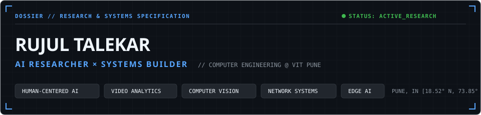
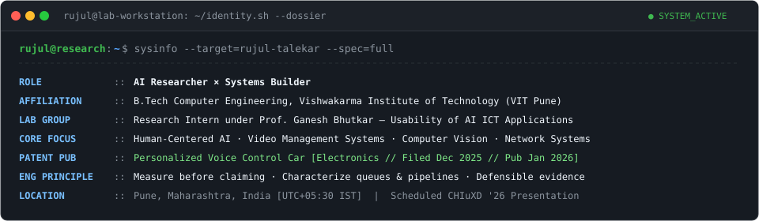
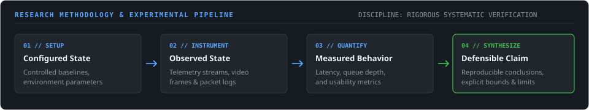
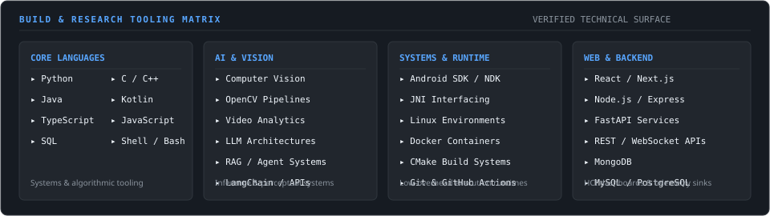

<div align="center">

<picture>
  <source media="(prefers-color-scheme: dark)" srcset="assets/banner-dark.svg">
  <source media="(prefers-color-scheme: light)" srcset="assets/banner-light.svg">
  
</picture>

<br/>

<picture>
  <source media="(prefers-color-scheme: dark)" srcset="assets/identity-dark.svg">
  <source media="(prefers-color-scheme: light)" srcset="assets/identity-light.svg">
  
</picture>

</div>

---

### `// 01. CURRENT SIGNAL & OPERATIONAL STATUS`

| Research Vector | Focus / Scope | Operational State | Current Target |
| :--- | :--- | :---: | :--- |
| **Human-Centered AI &amp; Usability** | Interaction dynamics, AI usability evaluation in ICT systems | `[ACTIVE]` | Research group under Prof. Ganesh Bhutkar; scheduled CHIuXD 2026 presentation |
| **Video Management Systems (VMS)** | VMS architectures, streaming pipelines &amp; camera telemetry | `[ACTIVE]` | Structured literature-review corpus of 60 VMS-related academic papers (2015–2025) |
| **Edge AI &amp; Video Analytics** | Real-time perceptual inference, pipeline latency &amp; edge compute | `[ACTIVE]` | Multi-capability analytics verification &amp; RTSP telemetry pipelines |
| **Android Transport &amp; Networking** | Cellular queue latency, bufferbloat characterization &amp; mobile telemetry | `[EXPERIMENTAL]` | Android transport measurement tooling &amp; latency profiling |
| **LLM Architectures &amp; Agent Systems** | Retrieval-Augmented Generation, tool execution &amp; structured inference | `[EXPERIMENTAL]` | Grounded agent workflows, tool execution &amp; document synthesis |

---

### `// 02. SELECTED SYSTEMS & FLAGSHIP WORK`

> *A curated selection of publicly observable systems, technical showcases, and experimental projects.*

| System / Repository | Primary Domain | Problem Explored | Technical Stack | Experimental Status |
| :--- | :--- | :--- | :--- | :---: |
| [**`5G-Bufferbloat-App`**](https://github.com/Roojool/5G-Bufferbloat-App) | Android Networking / Transport | Investigating queue delay, latency inflation under loaded cellular connections, and transport telemetry on mobile devices | `Kotlin` `Java` `Android SDK` `Networking` `Telemetry` | `EXPERIMENTAL` <br/>*(Active exploration)* |
| [**`ai-video-analytics-showcase`**](https://github.com/Roojool/ai-video-analytics-showcase) | AI Video Analytics / VMS | Interactive research catalog detailing 28 computer vision capabilities with verified visual demonstrations and operational constraints | `Computer Vision` `Video Analytics` `VMS Architectures` `Web UI` | `STABLE SHOWCASE` <br/>*(Verified demos)* |
| [**`pmc-cctv-surveillance-editorial`**](https://github.com/Roojool/pmc-cctv-surveillance-editorial) | CCTV / Surveillance Systems | Interactive technical showcase exploring CCTV infrastructure, AI video analytics and VMS architecture in a municipal-scale scenario | `CCTV Systems` `VMS Architectures` `Video Analytics` `Technical Editorial` | `ACTIVE SHOWCASE` <br/>*(Technical showcase)* |

#### `// OTHER PUBLIC WORK`
- [**`5G-India-Gaming-Guide`**](https://github.com/Roojool/5G-India-Gaming-Guide) — Practical systems guide on optimizing Android 5G tethering / hotspot transport and reducing packet routing jitter for Windows endpoints.

---

### `// 03. RESEARCH PHILOSOPHY & METHODOLOGY`

Modern systems engineering and applied AI research require rigorous distinction between configuration, assumption, and measurable reality.

<div align="center">

<picture>
  <source media="(prefers-color-scheme: dark)" srcset="assets/research-dark.svg">
  <source media="(prefers-color-scheme: light)" srcset="assets/research-light.svg">
  
</picture>

</div>

#### Core Working Principles:
1. **Measure Before Claiming:** No optimization or algorithmic improvement is accepted without baseline and post-intervention comparative instrumentation.
2. **Distinguish Configuration from Behavior:** Parameterizing a pipeline does not guarantee runtime compliance; observable execution telemetry provides the ground truth.
3. **Preserve Negative Results:** Null hypotheses, failed latency thresholds, and unviable inference topologies are preserved as valid engineering signal.
4. **Defensible Limits:** State explicit boundaries, hardware constraints, and failure modes rather than claiming universal generalization.
5. **Reproducible Tooling:** Maintain reproducible configurations, explicit seeds, and controlled environments wherever feasible.

---

### `// 04. RESEARCH OUTPUT & ACADEMIC ENGAGEMENT`

#### Academic Affiliation & Lab Group
- **Institution:** Vishwakarma Institute of Technology (VIT Pune)
- **Role:** Research Intern under **Prof. Ganesh Bhutkar**
- **Research Group Focus:** Usability of AI ICT Applications
- **Scheduled Presentation:** CHIuXD 2026 (Indonesia, December 2026) — Research work examining usability frameworks and human-interaction metrics in AI-assisted ICT systems.
- **Corpus Synthesis:** Structured literature-review corpus of 60 VMS-related academic papers (2015–2025) examining Video Management Systems, distributed video pipelines, and surveillance analytics architectures.

#### Academic Publications & Research Output
```
[ PUBLICATIONS // VERIFIED ENTRIES BEING INDEXED ]
------------------------------------------------------------------------------------------------------
Verified publication entries, citation metadata, and preprint indices are currently being prepared
for public listing.
------------------------------------------------------------------------------------------------------
```
*(Verified entries will be indexed here with venue, year, DOI, and preprint links.)*

---

### `// 05. INTELLECTUAL PROPERTY & PATENTS`

| Property | Details |
| :--- | :--- |
| **Title** | **Personalized Voice Control Car** |
| **Field** | Electronics |
| **Filing Date** | 11 December 2025 |
| **Publication Date** | 23 January 2026 |
| **International Patent Classification (IPC)** | `G10L 17/00` · `G10L 17/22` · `G10L 15/22` · `G10L 17/04` · `G10L 17/02` |
| **Status** | Published *(Public Record)* |

---

### `// 06. BUILD & RESEARCH TOOLING MATRIX`

<div align="center">

<picture>
  <source media="(prefers-color-scheme: dark)" srcset="assets/stack-dark.svg">
  <source media="(prefers-color-scheme: light)" srcset="assets/stack-light.svg">
  
</picture>

</div>

<details>
<summary><b>View Detailed Technology Index</b></summary>
<br/>

- **Languages:** Python, C, C++, Java, Kotlin, TypeScript, JavaScript, SQL, POSIX Shell
- **AI & Perceptual Systems:** Computer Vision, OpenCV, Video Analytics, LLM Architectures, RAG Systems, LangChain, Model Inference APIs
- **Systems & Infrastructure:** Android SDK / NDK, JNI Interfacing, Linux Runtimes, Docker Containers, CMake, Git, GitHub Actions CI/CD
- **Web & Interface Engineering:** React, Next.js, Node.js, Express, FastAPI, MongoDB, MySQL, RESTful Services, WebSocket Streaming
</details>

---

### `// 07. CURRENTLY BUILDING // IN THE LAB`

Ongoing research efforts, active experimental sandboxes, and upcoming public technical repositories:

- 🔬 **Cellular Bufferbloat & Transport Feasibility:** Instrumenting queue depth, round-trip time variance, and downlink/uplink queuing delays on Android under variable radio link conditions.
- 📹 **VMS & Edge Video Analytics Experimentation:** Benchmarking RTSP ingest pipelines, multi-camera decode overhead, and low-latency edge inference setups.
- 👥 **Human-AI Interaction Usability Frameworks:** Developing quantitative usability rubrics for AI-augmented ICT tools in preparation for academic dissemination.

#### Planned Open Research Repositories *(In Development)*:
```
├── Frigate-VMS-Lab                 [IN DEVELOPMENT // VMS integration & NVR telemetry]
├── VMS-Literature-Evidence-Lab     [IN DEVELOPMENT // 60-paper corpus taxonomy & comparative matrix]
├── Human-AI-Usability-Lab          [IN DEVELOPMENT // Evaluation scripts & HCI usability rubrics]
└── OpenCV-RTSP-Latency-Lab         [IN DEVELOPMENT // Frame-dropping & end-to-end latency benchmarks]
```
*(Repositories will transition to public links upon completion of initial baseline benchmarks and documentation.)*

---

### `// 08. TELEMETRY & SYSTEM ACTIVITY`

<div align="center">

<a href="https://github.com/Roojool">
  
</a>
&nbsp;&nbsp;
<a href="https://github.com/Roojool">
  
</a>

</div>

---

### `// 09. SECURE TRANSMISSION // CONNECT`

<div align="center">

[](https://www.linkedin.com/in/rujul-talekar/)
&nbsp;
[](https://github.com/Roojool)

<br/>

```
[ RESEARCH / ENGINEERING CONTACT ]  ·  Pune, Maharashtra, India  ·  UTC+05:30 IST
Portfolio Website & Academic Dissemination Links Available Post-Release
```

</div>

---

<div align="center">
<sub>Repository telemetry tracked automatically via <a href=".github/workflows/refresh-profile.yml">refresh-profile.yml</a> · Structured profile records maintained in <a href="data/profile.json">profile.json</a></sub>
</div>
